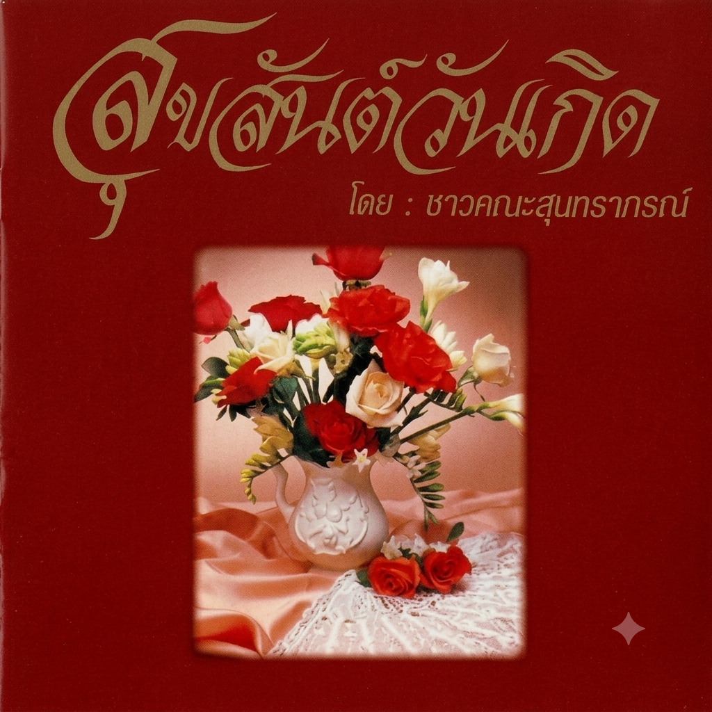

# 🎂 Birthday Mom

An interactive 3D birthday web experience created as a special birthday gift for Mom. 💗

The website combines a cute 3D character, an interactive postcard, and a pastel-themed music player into a small personalized birthday experience.

## ✨ Features

* 🎂 **Interactive Birthday Experience**

  * Personalized birthday greeting
  * Animated 3D mother character
  * Cute 3D cat companion

* 💌 **Interactive Postcard**

  * Floating mail button
  * Animated postcard opening
  * 3D card flip interaction
  * Personalized birthday message

* 🎵 **Pastel Music Player**

  * Minimal pastel design
  * Album artwork
  * Play / Pause
  * Restart
  * Mute / Unmute
  * Interactive progress bar
  * Song duration display
  * Music starts when the postcard is flipped to the music side

* 🎨 **Visual Design**

  * Pastel color palette
  * Soft shadows and gradients
  * Notebook / music-note inspired decorative elements
  * Responsive layout
  * Smooth animations

* 📱 **Responsive**

  * Desktop
  * Tablet
  * Mobile

## 🛠️ Tech Stack

* HTML5
* CSS3
* Vanilla JavaScript
* Google Model Viewer
* Google Fonts
* Material Symbols
* GLB / GLTF 3D Models
* HTML5 Audio API

## 📁 Project Structure

```text
birthday-mom/
│
├── index.html
│
├── css/
│   ├── splash.css
│   └── style.css
│
├── js/
│   └── main.js
│
├── assets/
│   │
│   ├── audio/
│   │   └── birthday-song.mp3
│   │
│   ├── images/
│   │   └── mom-birthday-cover.png
│   │
│   ├── models/
│   │   ├── asian-woman-3d-model.glb
│   │   │
│   │   └── stylized-white-cat-3d-model.glb
│
└── README.md
```

## 🚀 Getting Started

### 1. Clone the Repository

```bash
git clone https://github.com/0n6k4v-Coder/birthday-mom.git
```

### 2. Open the Project

```bash
cd birthday-mom
```

### 3. Run with a Local Server

Because the project uses 3D models and external assets, it is recommended to run it through a local web server instead of opening `index.html` directly.

For example, with VS Code, install **Live Server** and open:

```text
index.html
```

Then select:

```text
Open with Live Server
```

Alternatively, using Python:

```bash
python -m http.server 5500
```

Then visit:

```text
http://localhost:5500
```

## 🎵 Music

The website uses an HTML5 `<audio>` element for music playback.

The music player is designed so that:

```text
Open Mail
     ↓
Birthday Postcard
     ↓
Flip Postcard
     ↓
Music Player
     ↓
Play Music
```

The music does **not** start when the mail button is opened.

## 🎨 Customization

### Change the 3D Mother Model

Update the model path in `index.html`:

```html
<model-viewer
    src="./assets/models/asian-woman-3d-model.glb"
    ...
>
</model-viewer>
```

### Change the Cat Model

Update the model path in `index.html`:

```html
<model-viewer
    src="./assets/models/stylized-white-cat-3d-model.glb"
    ...
>
</model-viewer>
```

### Change Album Artwork

Replace the file at:

```text
assets/images/mom-birthday-cover.png
```

with your preferred artwork.

Then the image source in `index.html` is already correct:

```html

```

### Change the Birthday Message

The message can be edited directly inside the postcard section of `index.html`.

## 🌐 Deployment

This is a static website, so it can be deployed using services such as:

* GitHub Pages
* Vercel
* Netlify
* Cloudflare Pages

No backend server or database is required.

## 💝 Purpose

This project was created as a personal digital birthday card for Mom — combining web development, 3D graphics, animation, and music into one interactive experience.

> Sometimes a small website can become a very personal gift. ❤️

## 📄 License

This project is intended primarily as a personal project.

If you reuse this project, make sure you have the appropriate rights to any:

* 3D models
* Images
* Music
* Fonts
* Other third-party assets

---

Made with ❤️ for Mom.